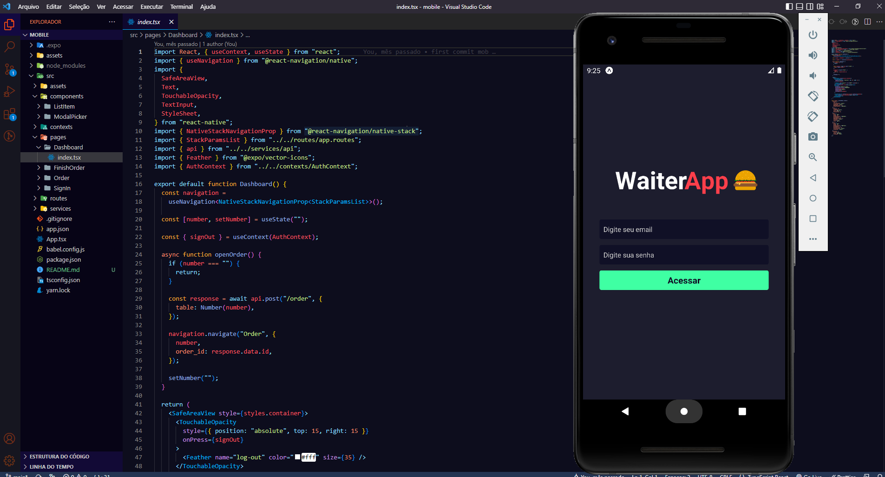

# WAITERAPP MOBILE

 

  

## Objetivo:

### Foi criar uma aplicação para o garçom anotar os pedidos dos clientes usando um tablet ou smartphone, tudo de forma automatizada

## Descrição:

### Sobre as tecnologias utilizadas.

- `Foi criado com React Native via expo + typescript.`

### O aplicativo vai.

- `Ter a opção de logar o estabelicimento que foi criado no sistema web`
- `Abrir uma ordem "mesa".`
- `Adicionar os produtos de acordo com aqueles que foram criados pelo restaurante`
- `Finalizar ordem.`
- `Ao ser finalizado, o pedido vai automaticamente para o dashboard, basta apenas eles atualizar o dasboard para ter acesso ao pedido.`

## <i>Douglas Monteiro</i> 😁🔥🚀
